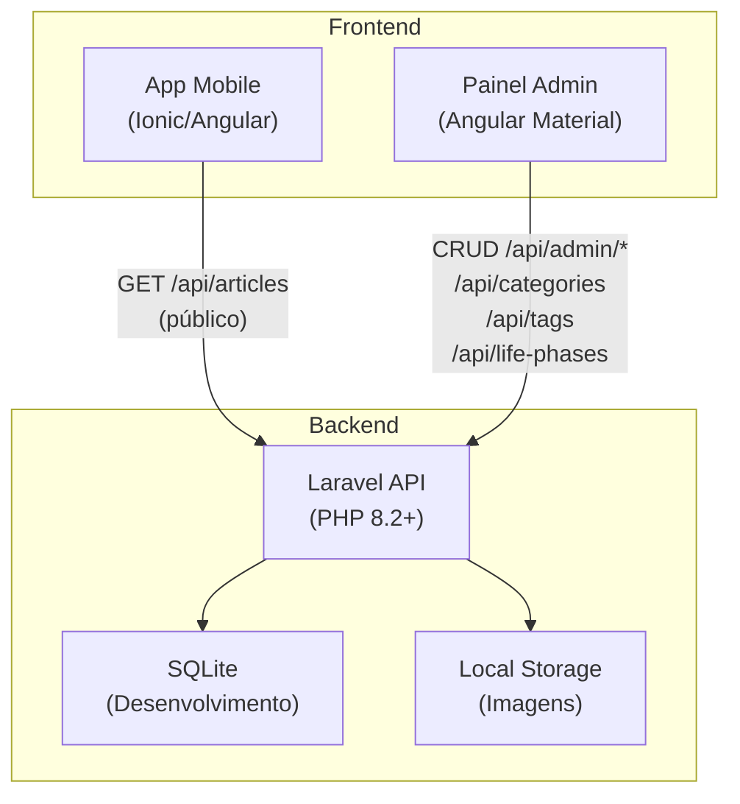
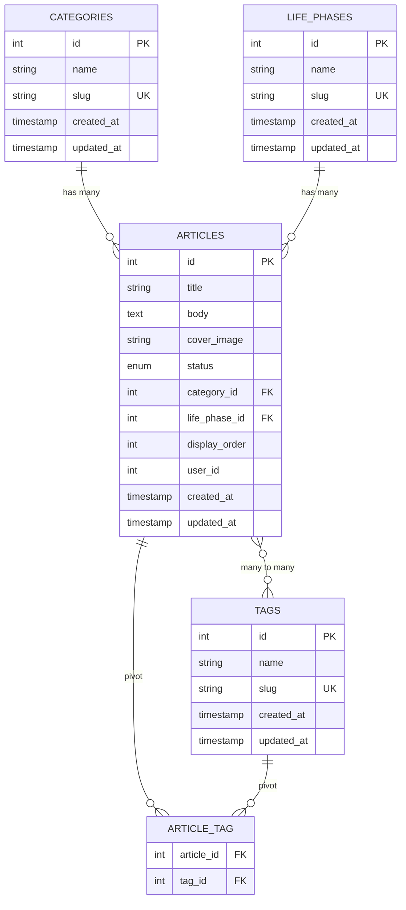
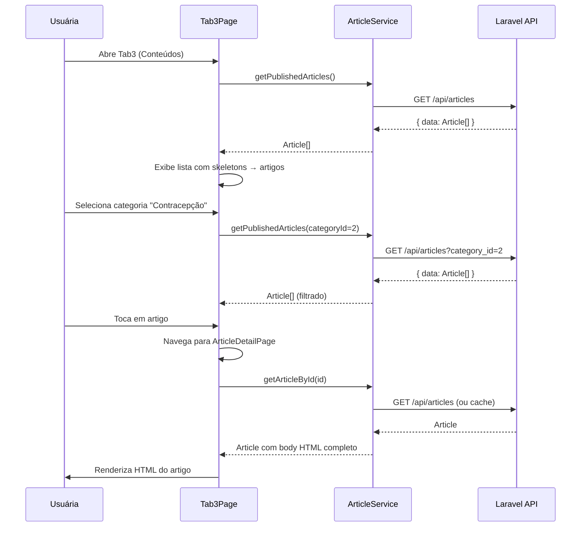

# Documento de Design: Gestão de Artigos

## Overview

O sistema de Gestão de Artigos é composto por três aplicações que se comunicam via API REST:

1. **Backend Laravel** (`/backend`): API REST que gerencia artigos, categorias, tags e fases de vida, utilizando SQLite para desenvolvimento local.
2. **Painel Administrativo** (`/admin`): Aplicação Angular com Angular Material para gerenciamento de conteúdo editorial.
3. **App Mobile** (raiz): Aplicação Ionic/Angular existente que consome a API pública para exibir artigos na Tab3.

### Diagrama de Arquitetura



## Architecture

### Padrão Arquitetural

O backend segue o padrão **MVC (Model-View-Controller)** do Laravel adaptado para API:

- **Models**: Eloquent ORM com relacionamentos definidos
- **Controllers**: Resource Controllers para CRUD padronizado
- **Form Requests**: Validação de dados isolada do controller
- **API Resources**: Transformação de dados para resposta JSON
- **Seeders**: Dados iniciais em português

O admin e o mobile seguem o padrão de **componentes Angular** com serviços para comunicação HTTP.

### Decisões Técnicas

| Decisão | Escolha | Justificativa |
|---------|---------|---------------|
| Banco de dados dev | SQLite | Zero configuração, ideal para desenvolvimento local |
| Autenticação | Nenhuma (user_id fixo = 1) | Simplificação para MVP, foco no conteúdo |
| Upload de imagens | Disco local (public) | Simplicidade para desenvolvimento, migrar para S3 depois |
| Editor rich-text | ngx-quill | Maduro, Angular-friendly, gera HTML limpo |
| Slug | Auto-gerado a partir de `name` | Consistência, URLs amigáveis sem input manual |
| CORS | Configuração para localhost | Permite desenvolvimento paralelo das 3 aplicações |
| Formato de resposta | JSON com API Resources | Controle fino sobre o formato de saída |

## Components and Interfaces

### Backend Laravel - Estrutura de Diretórios

```
backend/
├── app/
│   ├── Http/
│   │   ├── Controllers/
│   │   │   ├── CategoryController.php
│   │   │   ├── TagController.php
│   │   │   ├── LifePhaseController.php
│   │   │   ├── ArticleController.php
│   │   │   └── HealthController.php
│   │   ├── Requests/
│   │   │   ├── StoreCategoryRequest.php
│   │   │   ├── UpdateCategoryRequest.php
│   │   │   ├── StoreTagRequest.php
│   │   │   ├── UpdateTagRequest.php
│   │   │   ├── StoreLifePhaseRequest.php
│   │   │   ├── UpdateLifePhaseRequest.php
│   │   │   ├── StoreArticleRequest.php
│   │   │   └── UpdateArticleRequest.php
│   │   └── Resources/
│   │       ├── CategoryResource.php
│   │       ├── TagResource.php
│   │       ├── LifePhaseResource.php
│   │       └── ArticleResource.php
│   └── Models/
│       ├── Category.php
│       ├── Tag.php
│       ├── LifePhase.php
│       └── Article.php
├── database/
│   ├── migrations/
│   │   ├── create_categories_table.php
│   │   ├── create_tags_table.php
│   │   ├── create_life_phases_table.php
│   │   ├── create_articles_table.php
│   │   └── create_article_tag_table.php
│   └── seeders/
│       ├── DatabaseSeeder.php
│       ├── CategorySeeder.php
│       ├── TagSeeder.php
│       ├── LifePhaseSeeder.php
│       └── ArticleSeeder.php
├── routes/
│   └── api.php
├── storage/
│   └── app/public/  (imagens de capa)
└── config/
    └── cors.php
```

### Painel Admin Angular - Estrutura de Diretórios

```
admin/
├── src/
│   ├── app/
│   │   ├── app.component.ts
│   │   ├── app.routes.ts
│   │   ├── layout/
│   │   │   └── layout.component.ts    (sidebar + content area)
│   │   ├── services/
│   │   │   ├── category.service.ts
│   │   │   ├── tag.service.ts
│   │   │   ├── life-phase.service.ts
│   │   │   └── article.service.ts
│   │   ├── models/
│   │   │   ├── category.model.ts
│   │   │   ├── tag.model.ts
│   │   │   ├── life-phase.model.ts
│   │   │   └── article.model.ts
│   │   ├── categories/
│   │   │   ├── category-list.component.ts
│   │   │   └── category-form.component.ts
│   │   ├── tags/
│   │   │   ├── tag-list.component.ts
│   │   │   └── tag-form.component.ts
│   │   ├── life-phases/
│   │   │   ├── life-phase-list.component.ts
│   │   │   └── life-phase-form.component.ts
│   │   ├── articles/
│   │   │   ├── article-list.component.ts
│   │   │   └── article-form.component.ts
│   │   └── shared/
│   │       └── confirm-dialog.component.ts
│   └── environments/
│       ├── environment.ts
│       └── environment.prod.ts
├── angular.json
├── package.json
└── tsconfig.json
```

### App Mobile - Novos Arquivos

```
src/app/
├── services/
│   └── article.service.ts
├── models/
│   ├── article.model.ts
│   └── category.model.ts
├── tab3/
│   ├── tab3.page.ts          (refatorado)
│   ├── tab3.page.html        (refatorado)
│   ├── tab3.page.scss
│   ├── tab3-routing.module.ts (atualizado com rota detail)
│   └── article-detail/
│       ├── article-detail.page.ts
│       ├── article-detail.page.html
│       └── article-detail.page.scss
```

### Interfaces dos Controllers (Backend)

```php
// CategoryController - Resource Controller
class CategoryController extends Controller
{
    public function index(): AnonymousResourceCollection;       // GET /api/categories
    public function store(StoreCategoryRequest $r): CategoryResource;  // POST /api/categories
    public function show(Category $category): CategoryResource;        // GET /api/categories/{id}
    public function update(UpdateCategoryRequest $r, Category $c): CategoryResource; // PUT
    public function destroy(Category $category): Response;             // DELETE
}

// ArticleController - Dual endpoint (public + admin)
class ArticleController extends Controller
{
    public function index(Request $request): AnonymousResourceCollection;      // GET /api/articles (public)
    public function adminIndex(Request $request): AnonymousResourceCollection; // GET /api/admin/articles
    public function store(StoreArticleRequest $r): ArticleResource;            // POST /api/admin/articles
    public function show(Article $article): ArticleResource;                   // GET /api/admin/articles/{id}
    public function update(UpdateArticleRequest $r, Article $a): ArticleResource; // PUT
    public function destroy(Article $article): Response;                        // DELETE
}
```

### Interfaces dos Services (Admin)

```typescript
// category.service.ts
@Injectable({ providedIn: 'root' })
export class CategoryService {
  getAll(): Observable<Category[]>;
  getById(id: number): Observable<Category>;
  create(data: { name: string }): Observable<Category>;
  update(id: number, data: { name: string }): Observable<Category>;
  delete(id: number): Observable<void>;
}

// article.service.ts
@Injectable({ providedIn: 'root' })
export class ArticleService {
  getAll(filters?: ArticleFilters): Observable<Article[]>;
  getById(id: number): Observable<Article>;
  create(data: FormData): Observable<Article>;
  update(id: number, data: FormData): Observable<Article>;
  delete(id: number): Observable<void>;
}
```

### Interfaces dos Services (Mobile)

```typescript
// article.service.ts (mobile)
@Injectable({ providedIn: 'root' })
export class ArticleService {
  getPublishedArticles(categoryId?: number): Observable<Article[]>;
  getArticleById(id: number): Observable<Article>;
}
```

## Data Models

### Diagrama ER



### Modelos Eloquent

```php
// Category Model
class Category extends Model
{
    protected $fillable = ['name', 'slug'];

    public function articles(): HasMany
    {
        return $this->hasMany(Article::class);
    }

    // Auto-gerar slug via boot() ou Observer
    protected static function booted(): void
    {
        static::creating(function (Category $category) {
            $category->slug = Str::slug($category->name);
        });
        static::updating(function (Category $category) {
            if ($category->isDirty('name')) {
                $category->slug = Str::slug($category->name);
            }
        });
    }
}

// Article Model
class Article extends Model
{
    protected $fillable = [
        'title', 'body', 'cover_image', 'status',
        'category_id', 'life_phase_id', 'display_order', 'user_id'
    ];

    protected $casts = [
        'display_order' => 'integer',
        'user_id' => 'integer',
    ];

    public function category(): BelongsTo
    {
        return $this->belongsTo(Category::class);
    }

    public function lifePhase(): BelongsTo
    {
        return $this->belongsTo(LifePhase::class);
    }

    public function tags(): BelongsToMany
    {
        return $this->belongsToMany(Tag::class, 'article_tag');
    }

    // Scope para artigos publicados
    public function scopePublished(Builder $query): Builder
    {
        return $query->where('status', 'published');
    }
}
```

### Interfaces TypeScript (Compartilhadas Admin e Mobile)

```typescript
export interface Category {
  id: number;
  name: string;
  slug: string;
  created_at?: string;
  updated_at?: string;
}

export interface Tag {
  id: number;
  name: string;
  slug: string;
  created_at?: string;
  updated_at?: string;
}

export interface LifePhase {
  id: number;
  name: string;
  slug: string;
  created_at?: string;
  updated_at?: string;
}

export interface Article {
  id: number;
  title: string;
  body: string;
  cover_image: string | null;
  status: 'published' | 'draft';
  category_id: number;
  life_phase_id: number | null;
  display_order: number;
  user_id: number;
  category?: Category;
  life_phase?: LifePhase;
  tags?: Tag[];
  created_at?: string;
  updated_at?: string;
}

export interface ArticleFilters {
  category_id?: number;
  tag_id?: number;
  life_phase_id?: number;
  status?: 'published' | 'draft';
}
```

## Contratos de API

### Health Check

```
GET /api/health
Response 200:
{ "status": "ok" }
```

### Categorias (mesmo padrão para Tags e Fases de Vida)

```
GET /api/categories
Response 200:
{
  "data": [
    { "id": 1, "name": "Menstruação", "slug": "menstruacao", "created_at": "...", "updated_at": "..." }
  ]
}

POST /api/categories
Body: { "name": "Menstruação" }
Response 201:
{
  "data": { "id": 1, "name": "Menstruação", "slug": "menstruacao", "created_at": "...", "updated_at": "..." }
}

Response 422 (validação):
{
  "message": "The name field is required.",
  "errors": { "name": ["The name field is required."] }
}

GET /api/categories/{id}
Response 200:
{
  "data": { "id": 1, "name": "Menstruação", "slug": "menstruacao", "created_at": "...", "updated_at": "..." }
}

Response 404:
{ "message": "Categoria não encontrada." }

PUT /api/categories/{id}
Body: { "name": "Menstruação Atualizada" }
Response 200:
{
  "data": { "id": 1, "name": "Menstruação Atualizada", "slug": "menstruacao-atualizada", "created_at": "...", "updated_at": "..." }
}

DELETE /api/categories/{id}
Response 204 (sem corpo)
```

### Artigos - Endpoint Público

```
GET /api/articles?category_id=1&life_phase_id=2&tag_id=3
Response 200:
{
  "data": [
    {
      "id": 1,
      "title": "Ciclo Menstrual: Entenda as Fases",
      "body": "<p>O ciclo menstrual...</p>",
      "cover_image": "/storage/covers/ciclo-menstrual.jpg",
      "status": "published",
      "category_id": 1,
      "life_phase_id": 1,
      "display_order": 1,
      "user_id": 1,
      "category": { "id": 1, "name": "Menstruação", "slug": "menstruacao" },
      "life_phase": { "id": 1, "name": "Adolescência", "slug": "adolescencia" },
      "tags": [
        { "id": 1, "name": "Ciclo", "slug": "ciclo" }
      ],
      "created_at": "2024-01-01T00:00:00.000000Z",
      "updated_at": "2024-01-01T00:00:00.000000Z"
    }
  ]
}
```

### Artigos - Endpoint Admin

```
GET /api/admin/articles?category_id=1&status=draft
Response 200:
{
  "data": [ /* mesma estrutura, inclui rascunhos */ ]
}

POST /api/admin/articles
Content-Type: multipart/form-data
Body:
  title: "Novo Artigo"
  body: "<p>Conteúdo HTML</p>"
  cover_image: [arquivo]
  status: "draft"
  category_id: 1
  life_phase_id: 2
  display_order: 5
  tag_ids[]: 1
  tag_ids[]: 3
Response 201:
{
  "data": { /* artigo com relacionamentos */ }
}

PUT /api/admin/articles/{id}
Content-Type: multipart/form-data
Body: (mesmos campos, tag_ids substitui associações existentes)
Response 200:
{
  "data": { /* artigo atualizado */ }
}

DELETE /api/admin/articles/{id}
Response 204
```

## Arquitetura do Painel Admin

### Diagrama de Componentes

```mermaid
graph TB
    subgraph "Layout"
        Layout["LayoutComponent<br/>(mat-sidenav)"]
        Sidebar["Sidebar Navigation"]
        Content["Router Outlet"]
    end

    subgraph "Módulo Artigos"
        AList["ArticleListComponent<br/>(mat-table + filtros)"]
        AForm["ArticleFormComponent<br/>(reactive form + quill)"]
    end

    subgraph "Módulo Categorias"
        CList["CategoryListComponent<br/>(mat-table)"]
        CForm["CategoryFormComponent<br/>(mat-dialog)"]
    end

    subgraph "Módulo Tags"
        TList["TagListComponent<br/>(mat-table)"]
        TForm["TagFormComponent<br/>(mat-dialog)"]
    end

    subgraph "Módulo Fases de Vida"
        LList["LifePhaseListComponent<br/>(mat-table)"]
        LForm["LifePhaseFormComponent<br/>(mat-dialog)"]
    end

    subgraph "Shared"
        Confirm["ConfirmDialogComponent"]
    end

    subgraph "Services"
        CatSvc["CategoryService"]
        TagSvc["TagService"]
        LPSvc["LifePhaseService"]
        ArtSvc["ArticleService"]
    end

    Layout --> Sidebar
    Layout --> Content
    Content --> AList
    Content --> AForm
    Content --> CList
    Content --> TList
    Content --> LList

    CList --> CForm
    TList --> TForm
    LList --> LForm
    AList --> Confirm
    CList --> Confirm
    TList --> Confirm
    LList --> Confirm

    AList --> ArtSvc
    AForm --> ArtSvc
    CList --> CatSvc
    CForm --> CatSvc
    TList --> TagSvc
    TForm --> TagSvc
    LList --> LPSvc
    LForm --> LPSvc
```

### Rotas do Admin

```typescript
export const routes: Routes = [
  {
    path: '',
    component: LayoutComponent,
    children: [
      { path: '', redirectTo: 'articles', pathMatch: 'full' },
      { path: 'articles', component: ArticleListComponent },
      { path: 'articles/new', component: ArticleFormComponent },
      { path: 'articles/:id/edit', component: ArticleFormComponent },
      { path: 'categories', component: CategoryListComponent },
      { path: 'tags', component: TagListComponent },
      { path: 'life-phases', component: LifePhaseListComponent },
    ]
  }
];
```

### Padrão de Formulários (Categorias/Tags/Fases de Vida)

Para entidades simples (apenas campo `name`), o formulário será aberto em um `MatDialog` diretamente da tela de listagem, simplificando a navegação.

### Formulário de Artigos

O formulário de artigos é uma página dedicada (`/articles/new` e `/articles/:id/edit`) com:
- `FormGroup` reativo com validação
- ngx-quill para edição de corpo HTML
- `<input type="file">` para upload de imagem com preview
- `mat-select` para categoria e fase de vida
- `mat-select multiple` para tags
- `mat-slide-toggle` para status (rascunho/publicado)
- `mat-form-field` com `type="number"` para display_order

## Arquitetura de Integração Mobile

### Diagrama de Fluxo



### Refatoração da Tab3

A Tab3 atual possui conteúdo estático. A refatoração irá:

1. Injetar `ArticleService` no componente
2. Carregar categorias da API para gerar abas dinâmicas
3. Exibir artigos filtrados por categoria selecionada
4. Adicionar `ion-skeleton-text` durante carregamento
5. Adicionar tratamento de erro com botão "Tentar Novamente"
6. Trocar o template por cards dinâmicos com `*ngFor`

### Rota de Detalhe do Artigo

```typescript
// tab3-routing.module.ts (atualizado)
const routes: Routes = [
  { path: '', component: Tab3Page },
  { path: 'article/:id', component: ArticleDetailPage }
];
```

### Renderização HTML Segura

O corpo do artigo contém HTML. Para renderizá-lo no Ionic:

```typescript
// article-detail.page.ts
import { DomSanitizer, SafeHtml } from '@angular/platform-browser';

safeBody: SafeHtml;

ngOnInit() {
  this.safeBody = this.sanitizer.bypassSecurityTrustHtml(article.body);
}
```

```html
<!-- article-detail.page.html -->
<div [innerHTML]="safeBody" class="article-content"></div>
```

## Geração de Slug

A geração de slug utiliza `Str::slug()` do Laravel, que:
- Converte para minúsculas
- Remove acentos (transliteração)
- Substitui espaços por hífens
- Remove caracteres especiais

Exemplos:
- "Menstruação" → "menstruacao"
- "Saúde da Mulher" → "saude-da-mulher"
- "Pílula Anticoncepcional" → "pilula-anticoncepcional"

A validação de unicidade do slug é feita na camada de Form Request com regra `unique`.

## Correctness Properties

*Uma propriedade é uma característica ou comportamento que deve ser verdadeiro em todas as execuções válidas de um sistema — essencialmente, uma declaração formal sobre o que o sistema deve fazer. Propriedades servem como ponte entre especificações legíveis por humanos e garantias de corretude verificáveis por máquina.*

### Property 1: Geração de slug é determinística e consistente

*Para qualquer* string de nome válida (não vazia), a geração de slug deve sempre produzir o mesmo resultado quando aplicada à mesma entrada, e o resultado deve conter apenas caracteres minúsculos, hífens e dígitos.

**Validates: Requirements 2.1, 2.2, 2.3, 3.2, 4.2, 5.2**

### Property 2: Slug único garante unicidade por entidade

*Para quaisquer* dois registros do mesmo tipo (categoria, tag ou fase de vida) com nomes diferentes, se a geração de slug produzir o mesmo valor, a API deve rejeitar a segunda criação com erro 422.

**Validates: Requirements 3.4, 4.4, 5.4**

### Property 3: Endpoint público retorna apenas artigos publicados

*Para qualquer* conjunto de artigos no banco de dados com status variados (published/draft), o endpoint público `/api/articles` deve retornar exclusivamente artigos com status "published", nunca incluindo rascunhos.

**Validates: Requirements 6.2**

### Property 4: Filtros de artigos preservam a propriedade de subconjunto

*Para qualquer* combinação de filtros (category_id, tag_id, life_phase_id), o resultado filtrado deve ser um subconjunto do resultado sem filtros — cada artigo retornado deve satisfazer todos os filtros aplicados simultaneamente.

**Validates: Requirements 6.3, 6.4, 6.5, 6.6**

### Property 5: Sincronização de tags é idempotente

*Para qualquer* artigo e qualquer array de tag_ids, aplicar a sincronização de tags com o mesmo array repetidamente deve produzir o mesmo estado — as associações na tabela pivot devem refletir exatamente o array fornecido.

**Validates: Requirements 6.9, 6.11**

### Property 6: Operações CRUD preservam integridade referencial

*Para qualquer* artigo criado com category_id e tag_ids válidos, a consulta posterior do artigo deve retornar os relacionamentos corretos (categoria, fase de vida e tags associadas).

**Validates: Requirements 2.7, 6.7, 6.10**

## Error Handling

### Backend (Laravel)

| Cenário | Status HTTP | Corpo da Resposta |
|---------|-------------|-------------------|
| Recurso não encontrado | 404 | `{ "message": "Recurso não encontrado." }` |
| Validação falhou | 422 | `{ "message": "...", "errors": { "campo": ["..."] } }` |
| Erro interno | 500 | `{ "message": "Erro interno do servidor." }` |
| Rota não existe | 404 | `{ "message": "Rota não encontrada." }` |

A configuração de exceções do Laravel será ajustada em `bootstrap/app.php` para sempre retornar JSON em rotas `/api/*`.

### Painel Admin

- Erros 422: Exibir mensagens de validação inline nos campos do formulário
- Erros 404: Redirecionar para lista com `MatSnackBar` informando que o recurso não existe
- Erros de rede: `MatSnackBar` com mensagem "Falha na conexão com o servidor"
- Confirmação de exclusão: `MatDialog` com botões "Cancelar" e "Excluir"

### App Mobile

- Loading: `ion-skeleton-text` para cards e conteúdo
- Erro de rede: Mensagem amigável com botão "Tentar Novamente"
- Artigo não encontrado: Navegar de volta para lista

## Testing Strategy

### Backend (Laravel - PHPUnit)

**Testes de Feature (HTTP)**:
- Testar cada endpoint com dados válidos e inválidos
- Verificar status codes, formato de resposta e validações
- Testar filtros de artigos
- Testar upload de imagem
- Testar exclusão em cascata (pivot)

**Testes Unitários**:
- Geração de slug
- Scopes de query (published)
- Relacionamentos do modelo

**Testes de Property (PHPUnit com dados gerados)**:
- Biblioteca: utilizar geração programática de dados com Faker/Factory do Laravel
- Mínimo 100 iterações por propriedade
- Tag: **Feature: article-management, Property {N}: {descrição}**
- Cada propriedade do design será implementada como um teste com loop de 100 iterações usando factories

### Admin (Angular - Karma/Jasmine)

**Testes Unitários de Serviços**:
- Verificar URLs e métodos HTTP corretos via `HttpClientTestingModule`
- Verificar transformação de dados

**Testes de Componentes**:
- Verificar renderização de tabelas
- Verificar formulários e validação
- Verificar chamadas de serviço

### Mobile (Angular - Karma/Jasmine)

**Testes Unitários de Serviços**:
- Verificar chamadas HTTP corretas
- Verificar parâmetros de filtro

**Testes de Componentes**:
- Verificar estados de loading, erro e sucesso
- Verificar navegação para detalhe
