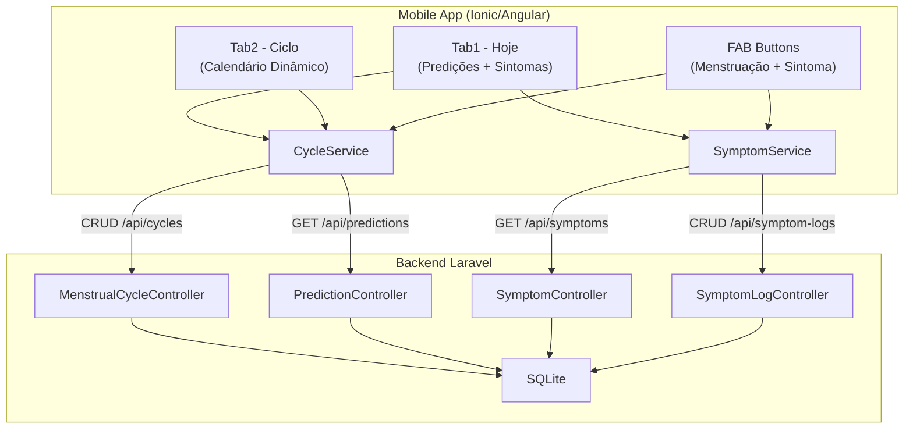
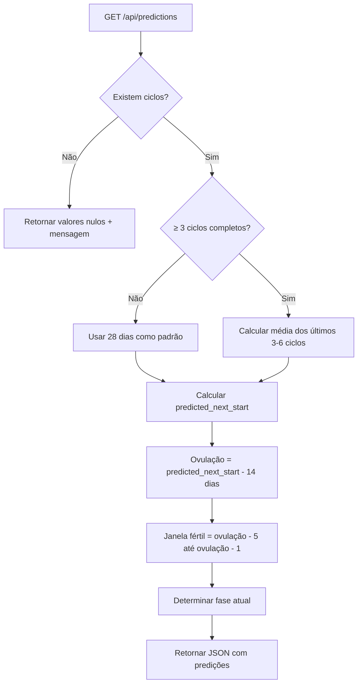
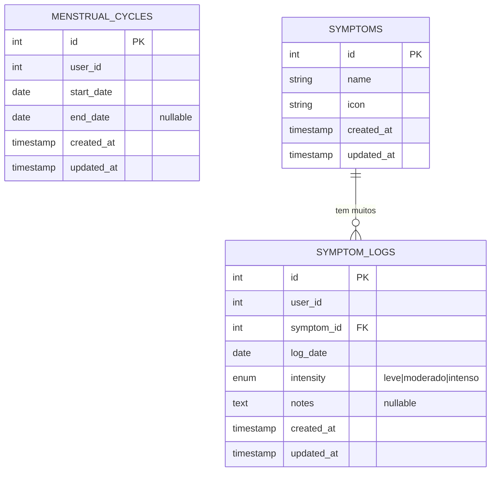

# Documento de Design: Calendário Menstrual e Rastreamento de Sintomas

## Visão Geral

O recurso de Calendário Menstrual e Rastreamento de Sintomas estende o aplicativo "Minha Saúde Feminina" com funcionalidades de registro e predição de ciclos menstruais, além de rastreamento diário de sintomas. O sistema é composto por:

1. **Backend Laravel** (`/backend`): APIs REST para ciclos menstruais, predições e sintomas, reutilizando o mesmo projeto Laravel existente (article-management).
2. **App Mobile** (raiz): Refatoração das Tab1 (Hoje) e Tab2 (Ciclo) para consumir dados dinâmicos da API, além da integração dos botões FAB com funcionalidade de registro rápido.

### Diagrama de Arquitetura



## Arquitetura

### Padrão Arquitetural

O backend segue o padrão **MVC do Laravel adaptado para API**, consistente com o módulo article-management existente:

- **Models**: Eloquent ORM com relacionamentos e casts
- **Controllers**: Resource Controllers para CRUD + Controller dedicado para predições
- **Form Requests**: Validação isolada com regras customizadas (overlap, enum)
- **API Resources**: Transformação padronizada para JSON
- **Seeders**: Dados fixos de sintomas em português

O mobile segue o padrão **Angular com Services** para comunicação HTTP e gerenciamento de estado local.

### Decisões Técnicas

| Decisão | Escolha | Justificativa |
|---------|---------|---------------|
| Banco de dados | SQLite (compartilhado com article-management) | Mesmo banco de dev, zero configuração extra |
| Autenticação | user_id = 1 fixo | MVP sem auth, consistente com article-management |
| Algoritmo de predição | Média dos últimos 3-6 ciclos completos | Balanço entre precisão e simplicidade |
| Ciclo padrão | 28 dias (quando < 3 ciclos) | Valor médio da literatura médica |
| Validação de overlap | Custom Rule no Laravel | Lógica encapsulada e reutilizável |
| Calendário mobile | Implementação customizada com grid CSS | Controle total sobre cores e interações |
| Estado do ciclo | API-driven (sem cache local) | Consistência de dados, simplicidade |
| Modal de sintomas | ion-modal com formulário reativo | Padrão Ionic, suporta validação Angular |

## Componentes e Interfaces

### Backend Laravel - Estrutura de Novos Arquivos

```
backend/
├── app/
│   ├── Http/
│   │   ├── Controllers/
│   │   │   ├── MenstrualCycleController.php
│   │   │   ├── PredictionController.php
│   │   │   ├── SymptomController.php
│   │   │   └── SymptomLogController.php
│   │   ├── Requests/
│   │   │   ├── StoreCycleRequest.php
│   │   │   ├── UpdateCycleRequest.php
│   │   │   └── StoreSymptomLogRequest.php
│   │   └── Resources/
│   │       ├── MenstrualCycleResource.php
│   │       ├── SymptomResource.php
│   │       └── SymptomLogResource.php
│   ├── Models/
│   │   ├── MenstrualCycle.php
│   │   ├── Symptom.php
│   │   └── SymptomLog.php
│   └── Rules/
│       └── NoCycleOverlap.php
├── database/
│   ├── migrations/
│   │   ├── create_menstrual_cycles_table.php
│   │   ├── create_symptoms_table.php
│   │   └── create_symptom_logs_table.php
│   └── seeders/
│       └── SymptomSeeder.php
└── routes/
    └── api.php  (rotas adicionadas)
```

### App Mobile - Novos/Refatorados Arquivos

```
src/app/
├── services/
│   ├── cycle.service.ts
│   └── symptom.service.ts
├── models/
│   ├── cycle.model.ts
│   ├── symptom.model.ts
│   └── prediction.model.ts
├── tab1/
│   ├── tab1.page.ts          (refatorado - dinâmico)
│   ├── tab1.page.html        (refatorado - dinâmico)
│   └── tab1.page.scss
├── tab2/
│   ├── tab2.page.ts          (refatorado - calendário interativo)
│   ├── tab2.page.html        (refatorado - calendário interativo)
│   └── tab2.page.scss
├── tabs/
│   ├── tabs.page.ts          (refatorado - lógica FAB)
│   ├── tabs.page.html        (refatorado - eventos FAB)
│   └── symptom-modal/
│       ├── symptom-modal.component.ts
│       ├── symptom-modal.component.html
│       └── symptom-modal.component.scss
```

### Interfaces dos Controllers (Backend)

```php
// MenstrualCycleController - Resource Controller
class MenstrualCycleController extends Controller
{
    public function index(): AnonymousResourceCollection;                    // GET /api/cycles
    public function store(StoreCycleRequest $request): MenstrualCycleResource; // POST /api/cycles
    public function update(UpdateCycleRequest $request, MenstrualCycle $cycle): MenstrualCycleResource; // PUT /api/cycles/{id}
    public function destroy(MenstrualCycle $cycle): JsonResponse;           // DELETE /api/cycles/{id}
}

// PredictionController
class PredictionController extends Controller
{
    public function index(): JsonResponse; // GET /api/predictions
}

// SymptomController - Somente leitura
class SymptomController extends Controller
{
    public function index(): AnonymousResourceCollection; // GET /api/symptoms
}

// SymptomLogController - Resource Controller
class SymptomLogController extends Controller
{
    public function index(Request $request): AnonymousResourceCollection;           // GET /api/symptom-logs
    public function store(StoreSymptomLogRequest $request): SymptomLogResource;     // POST /api/symptom-logs
    public function update(StoreSymptomLogRequest $request, SymptomLog $log): SymptomLogResource; // PUT /api/symptom-logs/{id}
    public function destroy(SymptomLog $symptomLog): JsonResponse;                 // DELETE /api/symptom-logs/{id}
}
```

### Interfaces dos Services (Mobile)

```typescript
// cycle.service.ts
@Injectable({ providedIn: 'root' })
export class CycleService {
  getCycles(): Observable<MenstrualCycle[]>;
  createCycle(startDate: string): Observable<MenstrualCycle>;
  updateCycle(id: number, endDate: string): Observable<MenstrualCycle>;
  deleteCycle(id: number): Observable<void>;
  getPredictions(): Observable<CyclePrediction>;
}

// symptom.service.ts
@Injectable({ providedIn: 'root' })
export class SymptomService {
  getSymptoms(): Observable<Symptom[]>;
  getSymptomLogs(startDate?: string, endDate?: string): Observable<SymptomLog[]>;
  createSymptomLog(data: CreateSymptomLogDto): Observable<SymptomLog>;
  updateSymptomLog(id: number, data: UpdateSymptomLogDto): Observable<SymptomLog>;
  deleteSymptomLog(id: number): Observable<void>;
}
```

### Lógica de Predição (PredictionController)



### Algoritmo de Fase Atual

```
Dado: último ciclo com start_date, average_cycle_length
dia_atual = (hoje - último_start_date) + 1

SE dia_atual entre 1 e 5: fase = "Menstrual"
SE dia_atual entre 6 e 13: fase = "Folicular"
SE dia_atual = 14: fase = "Ovulatória"
SE dia_atual >= 15: fase = "Lútea"
```

### Algoritmo de Detecção de Overlap

```
Dados: novo ciclo (new_start, new_end), ciclos existentes do usuário

Para cada ciclo existente (existing_start, existing_end):
  SE new_end é NULL: verificar apenas se new_start está entre [existing_start, existing_end]
  SENÃO:
    overlap = (new_start <= existing_end) AND (new_end >= existing_start)
    SE overlap: rejeitar com 422
```

## Modelos de Dados

### Diagrama ER



### Modelos Eloquent

```php
// MenstrualCycle.php
class MenstrualCycle extends Model
{
    protected $fillable = ['user_id', 'start_date', 'end_date'];
    protected $casts = [
        'start_date' => 'date',
        'end_date' => 'date',
    ];
}

// Symptom.php
class Symptom extends Model
{
    protected $fillable = ['name', 'icon'];

    public function logs(): HasMany
    {
        return $this->hasMany(SymptomLog::class);
    }
}

// SymptomLog.php
class SymptomLog extends Model
{
    protected $fillable = ['user_id', 'symptom_id', 'log_date', 'intensity', 'notes'];
    protected $casts = [
        'log_date' => 'date',
    ];

    public function symptom(): BelongsTo
    {
        return $this->belongsTo(Symptom::class);
    }
}
```

### Interfaces TypeScript (Mobile)

```typescript
// cycle.model.ts
export interface MenstrualCycle {
  id: number;
  user_id: number;
  start_date: string;      // formato: YYYY-MM-DD
  end_date: string | null;
  created_at: string;
  updated_at: string;
}

// prediction.model.ts
export interface CyclePrediction {
  predicted_next_start: string | null;
  fertile_window_start: string | null;
  fertile_window_end: string | null;
  average_cycle_length: number | null;
  current_phase: string | null;
  message?: string;
}

// symptom.model.ts
export interface Symptom {
  id: number;
  name: string;
  icon: string;
}

export interface SymptomLog {
  id: number;
  user_id: number;
  symptom_id: number;
  symptom?: Symptom;
  log_date: string;
  intensity: 'leve' | 'moderado' | 'intenso';
  notes: string | null;
  created_at: string;
  updated_at: string;
}

export interface CreateSymptomLogDto {
  symptom_id: number;
  log_date: string;
  intensity: 'leve' | 'moderado' | 'intenso';
  notes?: string;
}

export interface UpdateSymptomLogDto {
  symptom_id?: number;
  log_date?: string;
  intensity?: 'leve' | 'moderado' | 'intenso';
  notes?: string;
}
```

### Contratos de API

#### POST /api/cycles

**Request:**
```json
{
  "start_date": "2026-03-05"
}
```

**Response 201:**
```json
{
  "data": {
    "id": 1,
    "user_id": 1,
    "start_date": "2026-03-05",
    "end_date": null,
    "created_at": "2026-03-05T10:00:00.000000Z",
    "updated_at": "2026-03-05T10:00:00.000000Z"
  }
}
```

**Response 422 (overlap):**
```json
{
  "message": "O período informado sobrepõe um ciclo existente.",
  "errors": {
    "start_date": ["O período informado sobrepõe um ciclo existente."]
  }
}
```

#### GET /api/predictions

**Response 200 (com dados suficientes):**
```json
{
  "predicted_next_start": "2026-04-02",
  "fertile_window_start": "2026-03-24",
  "fertile_window_end": "2026-03-28",
  "average_cycle_length": 28,
  "current_phase": "Folicular"
}
```

**Response 200 (sem dados):**
```json
{
  "predicted_next_start": null,
  "fertile_window_start": null,
  "fertile_window_end": null,
  "average_cycle_length": null,
  "current_phase": null,
  "message": "Registre pelo menos um ciclo para obter predições."
}
```

#### POST /api/symptom-logs

**Request:**
```json
{
  "symptom_id": 1,
  "log_date": "2026-03-20",
  "intensity": "moderado",
  "notes": "Após almoço"
}
```

**Response 201:**
```json
{
  "data": {
    "id": 1,
    "user_id": 1,
    "symptom_id": 1,
    "symptom": { "id": 1, "name": "Cólica", "icon": "fitness-outline" },
    "log_date": "2026-03-20",
    "intensity": "moderado",
    "notes": "Após almoço",
    "created_at": "2026-03-20T14:30:00.000000Z",
    "updated_at": "2026-03-20T14:30:00.000000Z"
  }
}
```

#### GET /api/symptom-logs?start_date=2026-03-01&end_date=2026-03-31

**Response 200:**
```json
{
  "data": [
    {
      "id": 1,
      "user_id": 1,
      "symptom_id": 1,
      "symptom": { "id": 1, "name": "Cólica", "icon": "fitness-outline" },
      "log_date": "2026-03-20",
      "intensity": "moderado",
      "notes": "Após almoço",
      "created_at": "2026-03-20T14:30:00.000000Z",
      "updated_at": "2026-03-20T14:30:00.000000Z"
    }
  ]
}
```

## Propriedades de Corretude

*Uma propriedade é uma característica ou comportamento que deve ser verdadeiro em todas as execuções válidas de um sistema — essencialmente, uma declaração formal sobre o que o sistema deve fazer. Propriedades servem como ponte entre especificações legíveis por humanos e garantias de corretude verificáveis por máquina.*

### Propriedade 1: Ordenação decrescente de ciclos

*Para qualquer* conjunto de ciclos menstruais retornado pela API GET /api/cycles, a lista resultante SHALL estar ordenada por start_date em ordem decrescente (o ciclo mais recente primeiro).

**Valida: Requisito 2.3**

### Propriedade 2: Rejeição de datas inválidas

*Para qualquer* par de datas (start_date, end_date) onde end_date é anterior a start_date, a API_Ciclos SHALL rejeitar a requisição com status 422.

**Valida: Requisito 2.5**

### Propriedade 3: Detecção de sobreposição de ciclos

*Para qualquer* ciclo existente E e novo ciclo N, se o período [N.start_date, N.end_date] tem interseção com [E.start_date, E.end_date], a API_Ciclos SHALL rejeitar a criação com status 422.

**Valida: Requisito 2.6**

### Propriedade 4: Consistência da média de ciclos

*Para qualquer* histórico com 3 ou mais ciclos completos, o average_cycle_length retornado pela API_Predicoes SHALL ser igual à média aritmética dos comprimentos dos últimos 3 a 6 ciclos completos (onde comprimento = end_date - start_date do ciclo seguinte até start_date do anterior).

**Valida: Requisitos 3.1, 3.2**

### Propriedade 5: Corretude do cálculo de fase

*Para qualquer* dia D dentro de um ciclo (1 ≤ D ≤ cycle_length), a API_Predicoes SHALL retornar a fase correta: "Menstrual" se D ∈ [1,5], "Folicular" se D ∈ [6,13], "Ovulatória" se D = 14, "Lútea" se D ≥ 15.

**Valida: Requisito 3.5**

### Propriedade 6: Corretude da janela fértil

*Para qualquer* average_cycle_length calculado, a janela fértil SHALL iniciar 19 dias antes do predicted_next_start (ovulação no dia 14, menos 5 dias) e terminar 15 dias antes do predicted_next_start (um dia antes da ovulação).

**Valida: Requisito 3.4**

### Propriedade 7: Filtragem correta de registros por data

*Para qualquer* intervalo de datas [start_date, end_date] fornecido como filtro na API GET /api/symptom-logs, todos os registros retornados SHALL ter log_date dentro do intervalo especificado (start_date ≤ log_date ≤ end_date).

**Valida: Requisito 4.3**

### Propriedade 8: Rejeição de intensidade inválida

*Para qualquer* string que não seja "leve", "moderado" ou "intenso" fornecida como valor de intensity ao criar um registro de sintoma, a API_Sintomas SHALL rejeitar a requisição com status 422.

**Valida: Requisito 4.6**

## Tratamento de Erros

### Backend (Laravel)

| Cenário | Status HTTP | Resposta |
|---------|-------------|----------|
| Validação de campos obrigatórios | 422 | `{ "message": "...", "errors": { "field": ["mensagem"] } }` |
| end_date < start_date | 422 | Erro em `end_date` com mensagem descritiva |
| Sobreposição de ciclos | 422 | Erro em `start_date` indicando sobreposição |
| Intensidade inválida | 422 | Erro em `intensity` com valores permitidos |
| symptom_id inexistente | 422 | Erro em `symptom_id` indicando sintoma inválido |
| Ciclo não encontrado | 404 | `{ "message": "Registro não encontrado." }` |
| Sem ciclos para predição | 200 | Campos nulos + `message` orientativa |
| Erro interno | 500 | `{ "message": "Erro interno do servidor." }` |

### Mobile (Angular)

| Cenário | Comportamento |
|---------|---------------|
| Erro de rede | Toast com "Erro de conexão. Verifique sua internet." |
| Erro 422 da API | Exibir mensagem de erro do backend ao usuário |
| Erro ao registrar ciclo (FAB) | Toast de erro, manter estado atual |
| Erro ao registrar sintoma (Modal) | Exibir erro no modal, manter modal aberto |
| Sem dados de predição | Cards com mensagem "Registre ciclos para ver predições" |
| Timeout de requisição | Toast com "Servidor indisponível. Tente novamente." |

### Estratégia de Retry

- Requisições GET: retry automático com backoff (1s, 2s, 4s), máximo 3 tentativas
- Requisições POST/PUT/DELETE: sem retry automático (evitar duplicação)
- Implementar via operador RxJS `retry` com `delay`

## Estratégia de Testes

### Abordagem Dual

O projeto utiliza uma abordagem complementar de testes:

- **Testes unitários**: Validam exemplos específicos, edge cases e condições de erro
- **Testes de propriedade (PBT)**: Validam propriedades universais com inputs gerados aleatoriamente
- **Testes de integração**: Verificam a comunicação entre componentes e APIs

### Backend (Laravel - PHPUnit + Pest)

**Testes Unitários:**
- Validação de Form Requests (campos obrigatórios, formatos, enum)
- Lógica de predição (cálculos com dados conhecidos)
- Regra customizada de overlap (casos específicos)

**Testes de Feature (integração):**
- CRUD completo de ciclos via HTTP
- CRUD completo de symptom-logs via HTTP
- Endpoint de predições com diferentes cenários
- Listagem de sintomas

**Testes de Propriedade (Pest + Faker):**
- Biblioteca: **Pest PHP** com dados gerados via Faker
- Mínimo 100 iterações por propriedade
- Propriedades testadas:
  - Propriedade 1 (ordenação): gerar N ciclos aleatórios, verificar ordem
  - Propriedade 2 (datas inválidas): gerar pares com end < start, verificar rejeição
  - Propriedade 3 (overlap): gerar ciclos sobrepostos, verificar rejeição
  - Propriedade 4 (média): gerar históricos de 3-6 ciclos, verificar cálculo
  - Propriedade 5 (fase): gerar dias aleatórios 1-35, verificar fase correta
  - Propriedade 6 (janela fértil): gerar cycle_lengths, verificar datas
  - Propriedade 7 (filtro de data): gerar logs e ranges, verificar filtragem
  - Propriedade 8 (intensidade): gerar strings aleatórias, verificar rejeição
- Tag format: `/** Feature: menstrual-calendar, Property N: [título] */`

### Mobile (Angular - Jasmine/Karma)

**Testes Unitários:**
- CycleService: mock HttpClient, verificar chamadas corretas
- SymptomService: mock HttpClient, verificar chamadas e parâmetros
- Tab1Page: mock services, verificar renderização com dados
- Tab2Page: mock services, verificar interações do calendário
- SymptomModalComponent: verificar formulário e validação

**Testes de Integração:**
- Tab1 carrega e exibe dados de predição
- Tab2 carrega e renderiza ciclos no calendário
- FAB inicia/encerra ciclos corretamente
- Modal de sintoma submete dados corretamente

### Cobertura Mínima Esperada

- Backend: 80% de cobertura de código
- Mobile: 70% de cobertura de código
- Todas as 8 propriedades de corretude cobertas por PBT
